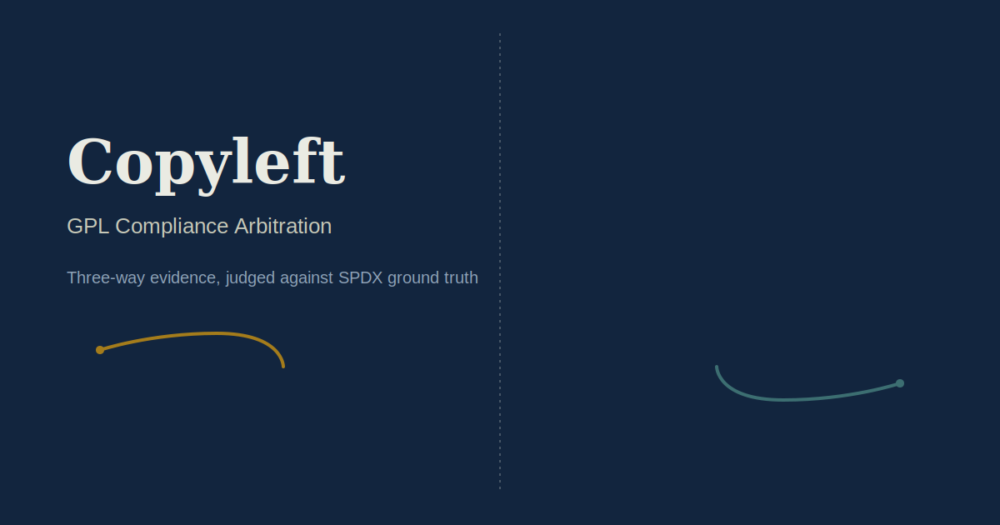

<div align="center">
  

  # Copyleft

  **On-chain arbitration for GPL-family license compliance disputes.**

  Claims are judged against the SPDX canonical license text, the downstream
  repo's own filings, and the disputed source — never against either
  party's word alone.

  [](https://copyleft.vercel.app/)
  [](#contracts)
  [](#license)
  [](https://genlayer.com)

  
</div>

---

## What this is

A downstream project is accused of shipping GPL-family licensed code
without providing source, attribution, or a compliant NOTICE. The claimant
stakes GEN and cites the alleged violation. The respondent counter-stakes
and rebuts. Resolution fetches evidence **three ways**:

1. The **SPDX canonical license text** — fixed, external, controlled by
   neither party.
2. The **downstream repo's own LICENSE/NOTICE file** — corroborating or
   undermining the respondent's compliance claim.
3. The **disputed source path** — the actual code alleged to trigger the
   obligation.

The verdict is judged against all three, not against either party's
framing. If a violation is found, the respondent gets a **cure window**
modeled on GPLv3's real reinstatement mechanic: submit a remediation
commit and receive one re-judgment before stakes settle.

## Why three-way evidence, not two

Two arbitrary URLs chosen by opposing parties is just narrative vs.
narrative — whichever party writes a more convincing page wins, which
proves nothing about actual compliance. Copyleft's third leg, SPDX
canonical text, is fixed and non-optional: the model checks both parties'
claims against an external ground truth neither party controls, not just
against each other.

## Live

| | |
|---|---|
| **App** | [copyleft.vercel.app](https://copyleft.vercel.app/) |
| **Repo** | [github.com/Siriron/copyleft](https://github.com/Siriron/copyleft) |

## Contracts

Redeployed Jul 18 2026 with the confirmed `resolve_dispute` fix (see
`docs/contracts.md` for what was wrong and what changed).

| Network | Address | Deployment TX |
|---|---|---|
| StudioNet | `0x9261d128EA0813144395247e7d7b6f7e12B1bCeC` | [view ↗](https://explorer-studio.genlayer.com/tx/0xcc09b93c710532ff4c70900271c771de8614d54ede2443e976e601a15f2c61d6) |
| Bradbury (testnet) | `0x58daEDCee44D1Cd2ae78f339A782CCA5B36314f0` | [view ↗](https://explorer-bradbury.genlayer.com/tx/0x217412a75efe48061c27011da78ed5c2b05df88ce092395fa2f1bb2053a98f1f) |

## Features

| | |
|---|---|
| 🏛️ **SPDX ground truth** | Every verdict traces to the license's actual canonical text, not either party's summary of it. |
| 🔍 **Three-way fetch** | Leader fetches all three evidence sources inside one nondeterministic call, before judgment. |
| 🛡️ **Independent re-derivation** | Validators re-run the leader's full logic and compare outcomes — never a shape-only check. |
| 🌿 **Real cure window** | Mirrors GPLv3 §8's actual reinstatement mechanic — remediate before final settlement. |
| ⚖️ **Deterministic settlement** | Stake payouts are fixed percentages of a judged outcome — never chance-based. |
| 🔗 **Dual-network** | Live on both Bradbury testnet and StudioNet, with a one-tap toggle. |

## Tech stack

**Contract** — Python on GenVM. `gl.vm.run_nondet_unsafe` leader/validator
consensus. Independent re-derivation validators on every write, including
the secondary cure path, not just the primary resolution.

**Frontend** — React 18 + Vite + TypeScript + Tailwind CSS + Framer Motion.
`genlayer-js` for chain interaction. Design system: ink `#12253E` / paper
`#EAEBE3` / seal `#A47C1B` / slate `#3C6E71`, Fraunces + IBM Plex Sans/Mono,
with an animated side-by-side diff view as the hero's signature element.

## Quick start

```bash
npm install
npm run dev
```

Contract addresses are pre-filled in the committed `.env` — both are
public, deployed addresses, not secrets. `.env.example` documents the
required keys for anyone setting up a fresh deployment.

## Documentation

| Doc | Covers |
|---|---|
| [`docs/architecture.md`](docs/architecture.md) | Evidence model, validator design, settlement logic, cure mechanic |
| [`docs/contracts.md`](docs/contracts.md) | Full public contract interface |
| [`docs/deployment.md`](docs/deployment.md) | Lint → Studio UI deploy → Vercel deploy workflow |
| [`docs/frontend.md`](docs/frontend.md) | Frontend structure and design system |

Also browsable in-app at [`/docs`](https://copyleft.vercel.app/docs).

## Repository structure

```
contracts/copyleft.py     GenVM contract — dispute lifecycle, nondet resolution, settlement
src/                       React + Vite + TypeScript frontend
  components/              Navbar, Footer, ErrorBoundary, NetworkToggle, DiffShowcase
  pages/                   Home, Disputes, DisputeDetail, FileDispute, Docs, NotFound
  lib/                     genlayer-js client wrappers, contract call hooks
  config/                  chain + contract address configuration
docs/                      architecture, deployment, frontend, contracts reference
public/                    favicon, OG image
```

## License

This repository's own code is licensed under the [MIT License](LICENSE).

Copyleft is not affiliated with the Free Software Foundation or SPDX.
SPDX license text is fetched from `spdx.org` at resolution time and is
never redistributed by this repository.

---

<div align="center">
  <sub>Built on <a href="https://genlayer.com">GenLayer</a></sub>
</div>
